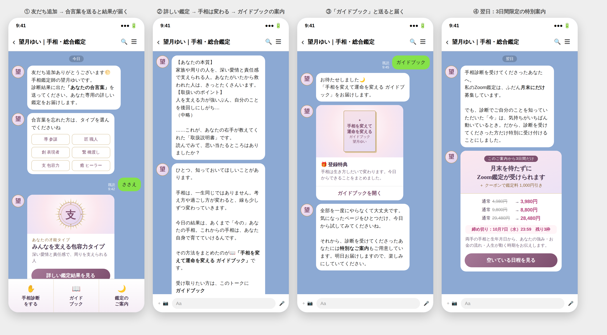

# LINE（プロライン）配信設計 ― 手相診断アプリ

## 1. 全体の流れ

```
診断アプリ → 友だち追加（手相診断アプリ専用の登録URL）
  → あいさつ：「合言葉を送ってください」＋タイプ選択ボタン
  → 合言葉（例：ささえ）を受信 → タイプ別タグ付与 → 詳しい鑑定を自動返信
  → 「手相は変わる」という話から、ガイドブックを案内
  → 「ガイドブック」と送ってくれた人にお届け（タグ付け）＋特別案内を予告
  → ステップ配信（登録日から7日間）
     └ 1日目：「3日間だけの特別案内」
     └ 未申込の人だけ：2日目 手相が変わった事例、3日目 お客様の声＋最終リマインド
        （通常は月末のみ募集のZoom鑑定を特別に受付＋1,000円引き）
  → フロント商品（鑑定 4,980円〜）→ バックエンド商品
```

## 画面イメージ



## 1-2. 入口は広く、出口で分ける（セグメント設計）

診断の入口は「自分を知りたい」という誰にでもある好奇心で広く集め、
回答（Q1 いちばん知りたいこと／Q8 いまの気分）で、LINE登録後の案内を分けます。

| 回答 | 想定する人 | LINEでの主な案内 |
|---|---|---|
| Q1「手相そのもの」 | 手相が純粋に好き・学びたい | 手相の豆知識 → 手相講座 |
| Q8「考えている」「疲れている」 | 悩みがあり、変化を求めている | ガイドブック → 総合鑑定 → チャットサポート |
| Q8「始めたい」 | 新しい一歩を探している | 総合鑑定 → 講座（学んで活かす道） |
| Q8「充実している」 | 前向き・好奇心 | 開運・金運のコンテンツ → 鑑定（さらに運を伸ばす） |

実装方法（どちらか）：
- **手軽な方法：** 詳しい鑑定の最後に「いちばん知りたいこと」をボタンで選んでもらい、タグを付ける。
- **自動で分ける方法：** プロラインで登録シナリオを分け、`config.js` の `lineUrlByTheme` にテーマ別のURLを入れる（例：`palm` だけ講座向けシナリオにする）。

## 2. プロラインでの設定

| 設定 | 内容 |
|---|---|
| 登録シナリオ | 「手相診断アプリ」専用のシナリオを作り、そのURLを `config.js` の `lineUrl` に設定する。今後ほかの診断アプリを作る場合も、アプリごとに登録シナリオを分ければ、**アプリごとに別のあいさつ・別の配信**になります |
| あいさつメッセージ | 下記3の文面。タイプの合言葉を打てない人のために、6タイプのボタンも付ける（ボタン応答でタグ付け） |
| キーワード応答 | 合言葉6つ（みちびき／たくみ／ひらめき／つなぐ／ささえ／いやし）→ タイプ別の詳しい鑑定を返信し、タグ「手相診断_○○」を付ける |
| キーワード応答 | 「ガイドブック」→ ガイドブックを返信し、タグ「ガイドブック受取」を付ける。表記ゆれ（がいどぶっく／ガイド／ガイドブック下さい など）も登録しておく |
| ステップ配信 | 下記5 |

※ 合言葉を送る前にブロックされる人を減らすため、あいさつから1時間後に「合言葉を送ると詳しい鑑定が届きます」とリマインドを1通入れる。

## 3. あいさつメッセージ（案）

> 友だち追加ありがとうございます。
> 手相鑑定師の望月ゆいです🌕
>
> 手相診断を受けてくださったんですね。
> 診断結果に表示された **「あなたの合言葉」** をこのトークに送ってください。
> あなたのタイプ専用の「詳しい鑑定結果」をすぐにお届けします。
>
> 合言葉を忘れてしまった方は、下のボタンからあなたのタイプを選んでくださいね。
> ［導 参謀タイプ］［匠 職人タイプ］［創 表現者タイプ］
> ［繋 橋渡しタイプ］［支 包容力タイプ］［癒 ヒーラータイプ］

## 4. 合言葉への返信（タイプ別の詳しい鑑定）

全タイプ共通で、次の構成にします。

1. あなたの本質（アプリより一歩深く）
2. 取扱いのポイント（力を発揮できる条件と、疲れやすいところ）
3. 才能の活かし方（仕事）
4. 金運のヒント
5. 共通の締め：「思い当たるところはありましたか？」で結び、別の吹き出しでガイドブックを案内する（下記）

### 導（みちびき）道をひらく参謀タイプ

> あなたは、物事を冷静に見極め、周りを正しい方向へ導ける人です。上向きの頭脳線は「現実を動かす力」と「商才」のあらわれ。本来は、人の上に立ったり、自分で物事を決めたりする立場でこそ輝く手相です。
>
> 【取扱いのポイント】
> 「頼られる力」が強いぶん、つい一人で抱え込みがち。人に任せる・頼ることを覚えると、あなたの判断力はもっと大きな場面で活きるようになります。
>
> 【才能の活かし方】
> 段取り力・判断力は、年齢を重ねるほど価値が上がる力です。「頼まれてやる」から「自分で選んでやる」に変えるだけで、同じ力が収入に変わり始めます。
>
> 【金運のヒント】
> あなたはお金の流れを読むのが得意な人。まずは「自分のためのお金の目標」を一つ決めてください。目的が決まったとき、あなたの金運は動き出します。

### 匠（たくみ）信頼を積み上げる職人タイプ

> あなたは、誠実さと粘り強さで、確かなものを積み上げていける人です。まっすぐな頭脳線は冷静さと継続力のあらわれ。一つのことを長く続けるほど、ほかの人には真似できない専門性が育つ手相です。
>
> 【取扱いのポイント】
> きちんとしようとする責任感が強いぶん、自分に厳しくなりがち。「7割できたらOK」と決めるだけで、心にも時間にも余白が生まれ、運の入る隙間ができます。
>
> 【才能の活かし方】
> あなたが「当たり前」にやってきたことの中に、人から求められる技術が眠っています。長く続けてきたこと、人から感謝されたことを3つ書き出してみてください。
>
> 【金運のヒント】
> 堅実にお金を守れる人ですが、自分のためにお金を使うことに罪悪感を持ちがち。小さなご褒美を自分に許すことが、お金の巡りを良くする第一歩です。

### 創（ひらめき）静かに光る表現者タイプ

> あなたは、落ち着いた外見の奥に、豊かな感性と想像力を秘めた人です。下向きの頭脳線は芸術性と直感力のあらわれ。「美しいもの」「心が動くもの」に関わるとき、才能が一気に開く手相です。
>
> 【取扱いのポイント】
> 感性が豊かなぶん、心が動かないことを続けると、人一倍エネルギーを消耗します。好きなことに触れる時間を、毎日の予定に先に入れてしまいましょう。
>
> 【才能の活かし方】
> 趣味や「好き」の延長に、第二の人生の仕事のタネがあります。昔好きだったこと、時間を忘れて没頭できることを思い出してみてください。
>
> 【金運のヒント】
> 我慢してお金を守るより、心が満たされることに使ったときに流れが良くなるタイプ。「ときめき」を基準にお金の使い方を見直してみてください。

### 繋（つなぐ）ご縁をつなぐ橋渡しタイプ

> あなたは、人の気持ちがわかる優しさと、物事を前に進める賢さをあわせ持つ人です。上にカーブした感情線と上向きの頭脳線は、「人」と「お金」の両方に縁がある手相。人と人を結ぶことで、豊かさを生み出せる人です。
>
> 【取扱いのポイント】
> 人に合わせるのが上手なぶん、本音を後回しにしがち。与えることと同じくらい「受け取る」ことを自分に許すと、ご縁も豊かさも巡り始めます。
>
> 【才能の活かし方】
> 聴く力、つなぐ力、場を和ませる力は、どんな仕事でも求められる才能です。「人の役に立つこと」でお金をいただくことを、自分に許してあげてください。
>
> 【金運のヒント】
> あなたの金運は「ご縁」から運ばれてきます。付き合う人を選ぶことが、金運を上げるいちばんの近道です。

### 支（ささえ）みんなを支える包容力タイプ

> あなたは、深い愛情と責任感で、家族や周りの人を支え続けてきた人です。上にカーブした感情線と、まっすぐな頭脳線は「愛情」と「責任感」を兼ね備えた手相。あなたがいたから救われた人は、きっとたくさんいます。
>
> 【取扱いのポイント】
> 人を支える力が強いぶん、自分のことを後回しにしがち。人に向けているその優しさを、自分にも少し向けてあげることが、運気を育てるいちばんの近道です。
>
> 【才能の活かし方】
> 人の成長や回復を支える力は、誰にでもあるものではありません。その力を「心から感謝され、自分も満たされる場所」で使うほど、人生はより豊かに広がっていきます。
>
> 【金運のヒント】
> 大切な人のためにお金を使える温かさが、あなたの魅力。その温かさを自分にも向けて「自分を喜ばせるお金」を少し持つと、金運はさらに巡り始めます。

### 癒（いやし）心を癒す感性のヒーラータイプ

> あなたは、人の痛みや場の空気を敏感に感じ取れる、とても優しい人です。上にカーブした感情線と下向きの頭脳線は、豊かな感受性と直感力、そして「癒しの才能」のあらわれです。
>
> 【取扱いのポイント】
> 感受性が強いぶん、人の感情を受け取りすぎて疲れてしまうことも。ひとりで心を整える時間を持つことが、あなたの才能を守るお守りになります。
>
> 【才能の活かし方】
> つらい経験を乗り越えてきたあなたの言葉には、同じように悩む人の心を軽くする力があります。これまでの人生の出来事には、ちゃんと意味があったのです。
>
> 【金運のヒント】
> 不安からお金を握りしめるほど、流れは滞ります。まずは自分の心と体を満たすこと。安心感が、あなたの金運の土台になります。

### 共通の締め（タイプ別の鑑定文の最後に付ける）

> ……これが、あなたの右手が教えてくれた「取扱説明書」です。
> 読んでみて、思い当たるところはありましたか？

鑑定文はここで一度終わらせます。問いかけで結ぶと、感想を返信してくれる人が出てきて、個別のやりとりが自然に始まります。

### ガイドブックの案内（鑑定文のすぐあと、別の吹き出しで送る）

> ひとつ、知っておいてほしいことがあります。
>
> 手相は、一生同じではありません。
> 考え方や過ごし方が変わると、線も少しずつ変わっていきます。
>
> 今日の結果は、あくまで「今の」あなたの手相。
> これからの手相は、あなた自身で育てていけるんです。
>
> その方法をまとめたのが
> 📖「手相を変えて運命を変える ガイドブック」です。
>
> 受け取りたい方は、このトークに
> **ガイドブック**
> と送ってくださいね。すぐにお届けします🌙

- 流れは「結果 → 手相は変わる → 変える方法 → ガイドブック」。結果の続きとして、自然に「欲しい」と思ってもらえる順番です。
- 「鑑定を受けた方の線が濃くなった」など実例があれば、2段落目に一文入れると説得力が増します（事実の場合のみ）。

### 「ガイドブック」への返信

> お待たせしました🌙
> 「手相を変えて運命を変える ガイドブック」をお届けします。
> ［ガイドブックを開く］
>
> 全部を一度にやらなくて大丈夫です。
> 気になったページをひとつだけ、今日から試してみてくださいね。
>
> それから、診断を受けてくださったあなたには
> **特別なご案内** もご用意しています。
> 数日後にお届けしますので、楽しみにしていてください。

**キーワードで受け取ってもらう理由**
- 自分から「ガイドブック」と送る＝もう一歩前に出た人です。タグ「ガイドブック受取」が付いた人は、有料鑑定の見込みが高い人として扱えます。
- 自分で取りにいった特典は、自動で送られてきた特典よりも読まれやすくなります。
- 送らなかった人には、1日後に「まだ受け取っていない方へ」を1通だけ送ります（タグがない人だけに配信）。

**その他**
- 無料の個別診断（写真を見るなど）は行いません。「続き」は、ガイドブックと有料鑑定で受け取ってもらう形です。
- ガイドブックの最後のページにも、特別案内への導線（「LINEで届くご案内をお見逃しなく」）を入れておくと効果的です。

## 5. ステップ配信（案）― 翌日に案内し、申し込みの有無で分岐

| 日 | 全員 | 未申込の人だけ |
|---|---|---|
| 当日 | 詳しい鑑定 →「手相は変わる」→ ガイドブックの案内 | |
| 1日後 | **特別案内（3日間限定）** | |
| 2日後 | | 手相が実際に変わった事例 |
| 3日後 | | お客様の声＋最終日のリマインド（朝） |
| 4日後〜 | 通常の定期配信へ（週1回程度）＋毎月の月末募集 | |

- 申し込んだ人には、それ以降の案内を止め、鑑定前のご案内（Zoomの入り方など）に切り替える。
- 申し込みの判定：STORESの購入はプロラインに自動では伝わらない前提で、**申し込みをプロラインのフォーム経由にする**（フォーム送信でタグ「鑑定申込」を付け、案内シナリオを停止 → 送信完了画面でSTORESの購入ページへ）。

## 5-2. 3日間限定の特別案内

**内容**
- 通常は **月末のみ募集** のZoom鑑定を、この3日間だけ特別に受け付ける
- さらに鑑定料から **1,000円引き**（STORESのクーポン）

**案内文（案）**

> 手相診断を受けてくださったあなたへ、3日間だけの特別なご案内です。
>
> 私のZoom鑑定は、ふだん **月末にだけ** 募集しています。
> でも、診断でご自分のことを知っていただいた「今」は、気持ちがいちばん動いているとき。
> だから、診断を受けてくださった方だけ、特別に受け付けることにしました。
>
> 🌙 このご案内から3日間限定
> ・月末を待たずにZoom鑑定をお受けいただけます
> ・クーポンコード「{コード}」で鑑定料から1,000円引き
>
> 受付締め切り：{案内日から3日後} 23:59
> ※ 枠には限りがあります

**STORESでの運用**
- STORESのクーポン機能で1,000円引きのクーポンを作り、コードはこの案内の中だけで伝える。
- クーポンは人ごとの期限を設定できないため、案内文に書いた締め切り（案内日から3日後）で運用する。コードは月ごとに変えると、使い回しを防げる。
- 月末以外の予約枠は、この案内を受けた人だけに見せる（STORESで公開範囲を限定できる設定があれば活用。なければ受付フォーム経由で日程を調整）。
- 月末以外の枠は「週○枠まで」など上限を決め、「残り○枠」を正直に伝える。
- 締め切りは本当に守る（締め切り後に同じ条件で受け付けると特典を信じてもらえなくなり、景品表示法の有利誤認にあたるおそれも）。
- 「今だけ」ではなく「このご案内から3日間限定」と正確に書く。

## 6. 商品導線の考え方

- **フロント商品は「占術名」でなく「手に入るもの」で案内する。**
  例：「あなたの強みと、これからの人生の地図がわかる 総合鑑定セッション」
- 無料診断（右手のみ）→ LINEの詳しい鑑定＋ガイドブック → 有料鑑定（両手＋生年月日＋タロット）と、**段階ごとに見える範囲が広がる** 形にすると、自然に次へ進んでもらえます。
- バックエンド（チャットサポート・講座）は、鑑定のあとに提案する（今の方針どおり）。
- パワーストーンは、鑑定後の「タイプ別・開運アイテム」として案内するのが自然です（診断アプリの段階では出さない）。

## 7. 表現上の注意

- 寿命・病気の断定はしない。
- 「このままだと不幸になる」など、不安をあおる表現は使わない（消費者契約法の霊感商法に関する規定の観点からも）。
- 「○人に1人」などの数字や、お客様の声は、根拠・掲載許可があるものだけを使う。
